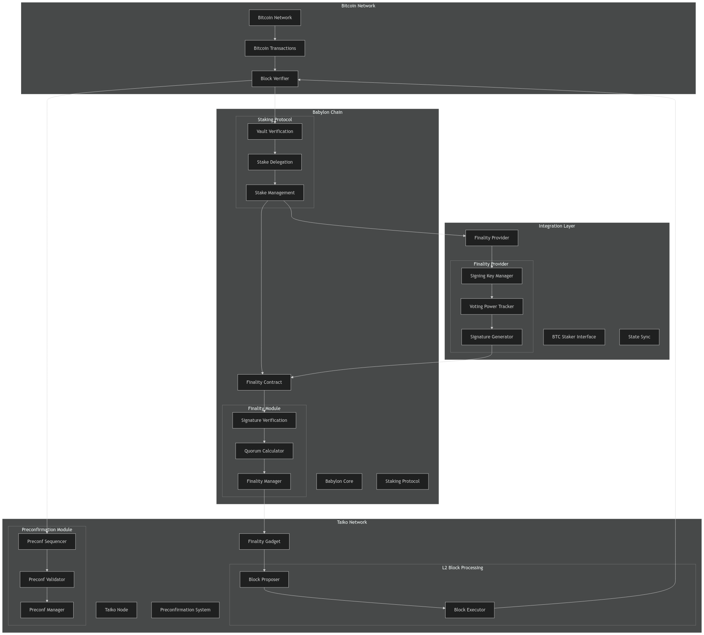
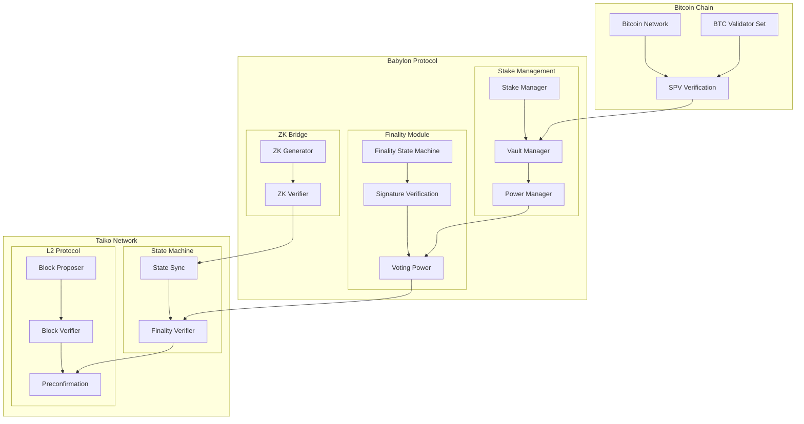
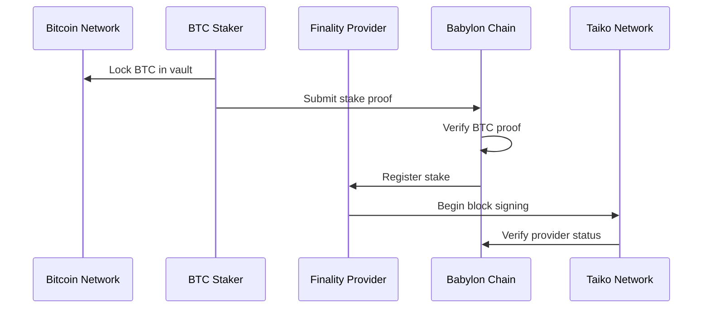
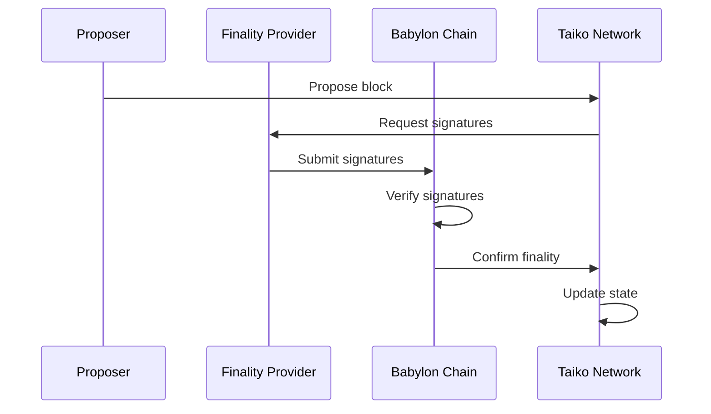

# Technical Specification: Babylon BTC Staking Integration for Taiko

## Table of Contents
1. Introduction
2. System Architecture
3. Component Design
4. Integration Flows
5. Security Model
6. Implementation Plan
7. Technical Appendix

## 1. Introduction

### 1.1 Purpose
This specification outlines the technical implementation for integrating Babylon's Bitcoin staking protocol with Taiko's based rollup architecture. 

### 1.2 Scope
The integration encompasses:
- BTC staking mechanisms
- Finality provider infrastructure
- Preconfirmation enhancement
- Security protocols
- State synchronization
- Cross-chain communication

### 1.3 Design Goals
- Maintain Taiko's 12-second block time
- Achieve sub-3-second preconfirmations
- Ensure slashable safety
- Preserve decentralization
- Enable trustless BTC staking

## 2. System Architecture

### 2.1 High-Level Architecture



### Cross-Chain Verification System




### 2.2 Core Components

#### 2.2.1 Babylon Components
- **Babylon Node**: Customized for OP-stack support
- **Finality Contract**: Manages BTC-backed signatures
- **Staking Protocol**: Handles BTC delegation and slashing
- **State Bridge**: Facilitates cross-chain communication

#### 2.2.2 Taiko Components
- **Based Rollup Core**: Manages L2 block production
- **Preconfirmation System**: Handles fast confirmations
- **Finality Gadget**: Processes BTC-backed signatures
- **State Manager**: Tracks finalized states

## 3. Component Design

### 3.1 Finality Provider Implementation

```typescript
interface FinalityProvider {
    // Core functionality
    submitSignature(block: Block): Promise<void>;
    verifyStake(provider: Address): Promise<BigNumber>;
    trackPreconfirmations(): void;
    
    // State management
    updateState(state: State): void;
    syncWithBabylon(): Promise<void>;
    
    // Security features
    detectEquivocation(): Promise<boolean>;
    reportViolation(proof: Proof): Promise<void>;
}
```

### 3.2 BTC Staking Contract

```solidity
contract BTCStaking {
    struct Stake {
        bytes32 btcTxHash;
        uint256 amount;
        address provider;
        uint256 lockPeriod;
    }
    
    struct Signature {
        bytes32 blockHash;
        bytes sig;
        uint256 timestamp;
    }
    
    mapping(address => Stake) public stakes;
    mapping(bytes32 => Signature[]) public blockSignatures;
    
    function stake(bytes32 txHash, bytes proof) external;
    function submitSignature(bytes32 blockHash, bytes sig) external;
    function verifyStake(address provider) external view returns (uint256);
    function slash(address provider, bytes proof) external;
}
```

### 3.3 Preconfirmation Enhancement

```solidity
contract EnhancedPreconfirmation {
    struct Preconfirmation {
        bytes32 blockHash;
        uint256 timestamp;
        bytes btcStakingProof;
        Signature[] signatures;
    }
    
    mapping(bytes32 => Preconfirmation) public preconfirmations;
    
    function submitPreconfirmation(
        bytes32 blockHash,
        bytes btcProof,
        Signature[] memory sigs
    ) external;
    
    function verifyPreconfirmation(bytes32 blockHash) 
        external view returns (bool, uint256);
}
```

## 4. Integration Flows

### 4.1 Staking Flow



### 4.2 Block Finalization Flow



## 5. Security Model

### 5.1 Slashing Conditions

```solidity
interface ISlashing {
    enum SlashingReason {
        Equivocation,
        InvalidSignature,
        PreconfirmationViolation
    }
    
    struct SlashingProof {
        bytes32 violation;
        bytes proof;
        uint256 timestamp;
    }
    
    function submitSlashingProof(
        address provider,
        SlashingReason reason,
        SlashingProof calldata proof
    ) external;
}
```

### 5.2 Security Parameters

```typescript
const SecurityConfig = {
    MIN_STAKE: "1.0 BTC",
    SLASH_AMOUNT: "0.1 BTC",
    QUORUM_THRESHOLD: "66%",
    FINALITY_BLOCKS: 100,
    MAX_REORG_DEPTH: 100,
    PRECONF_WINDOW: "3s"
};
```

## 6. Implementation Plan

### 6.1 Phase 1: Core Integration
1. Babylon node customization
2. Basic staking implementation
3. Signature verification system
4. Initial testing framework

### 6.2 Phase 2: Security Enhancement
1. Slashing mechanism implementation
2. Preconfirmation security
3. State sync optimization
4. Security auditing

### 6.3 Phase 3: Production Readiness
1. Performance optimization
2. Monitoring systems
3. Documentation
4. Mainnet preparation

## 7. Technical Appendix

### 7.1 API Specifications

#### 7.1.1 Finality Provider API

```typescript
interface FinalityProviderAPI {
    // Staking Management
    stake(amount: BigNumber, duration: number): Promise<void>;
    withdraw(amount: BigNumber): Promise<void>;
    
    // Block Processing
    signBlock(blockHash: string): Promise<Signature>;
    submitSignature(sig: Signature): Promise<void>;
    
    // State Management
    getStakingStatus(): Promise<StakingStatus>;
    getSignatureQuorum(blockHash: string): Promise<QuorumStatus>;
}
```

#### 7.1.2 Preconfirmation API

```typescript
interface PreconfirmationAPI {
    // Submission
    submitPreconfirmation(block: Block): Promise<void>;
    
    // Verification
    verifyPreconfirmation(
        blockHash: string,
        signatures: Signature[]
    ): Promise<boolean>;
    
    // Monitoring
    getPreconfirmationStatus(
        blockHash: string
    ): Promise<PreconfirmationStatus>;
}
```

### 7.2 State Transition Rules

```typescript
interface StateTransition {
    // State Types
    type BlockState = "Proposed" | "Preconfirmed" | "Finalized";
    type SignatureState = "Pending" | "Valid" | "Invalid";
    
    // Transition Functions
    function validateTransition(
        currentState: BlockState,
        newState: BlockState,
        proof: TransitionProof
    ): boolean;
    
    function applyTransition(
        state: BlockState,
        transition: Transition
    ): Promise<BlockState>;
}
```

### 7.3 Network Parameters

```typescript
const NetworkConfig = {
    // Timing Parameters
    BLOCK_TIME: "12s",
    PRECONF_INTERVAL: "3s",
    SIGNATURE_TIMEOUT: "6s",
    
    // Network Parameters
    MAX_BLOCK_SIZE: "2MB",
    MAX_SIGNATURES_PER_BLOCK: 100,
    MIN_FINALITY_CONFIRMATIONS: 6,
    
    // Staking Parameters
    MIN_STAKE_DURATION: "30 days",
    MAX_STAKE_DURATION: "365 days",
    SLASH_LOCK_PERIOD: "14 days"
};
```
